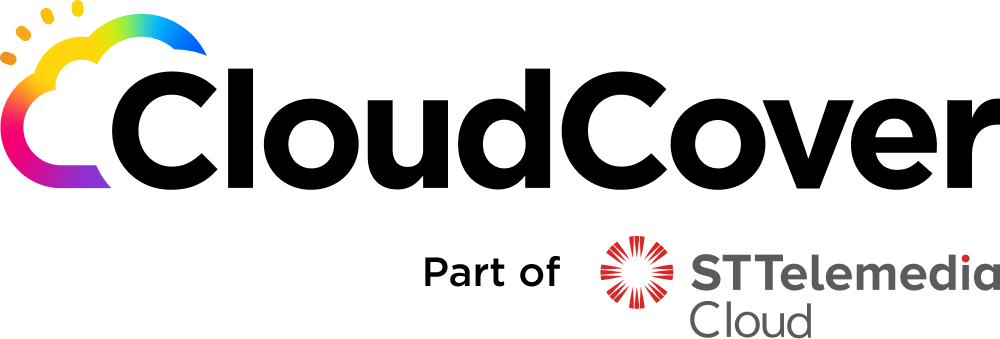
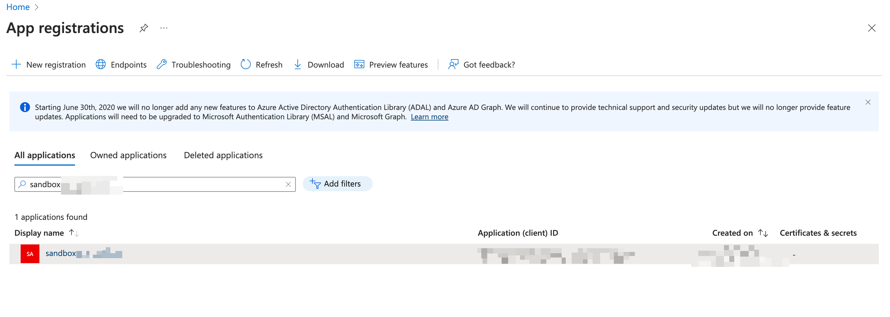
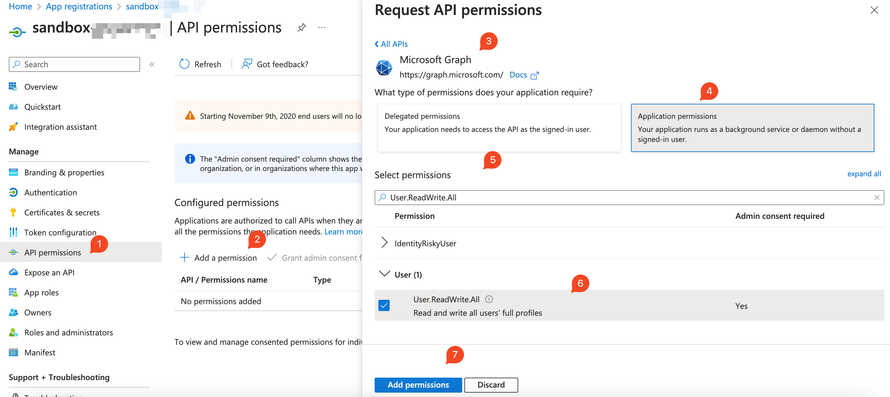
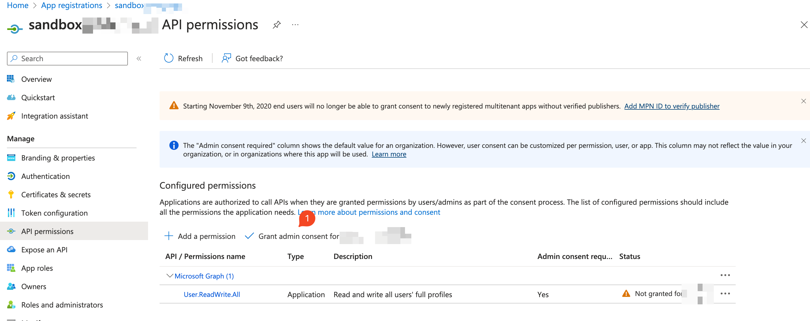
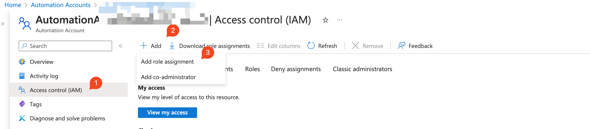
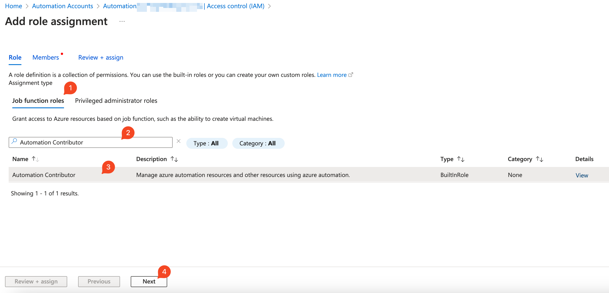
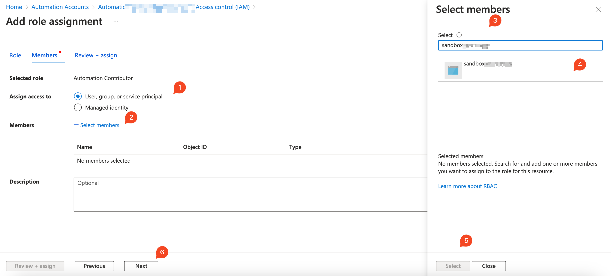
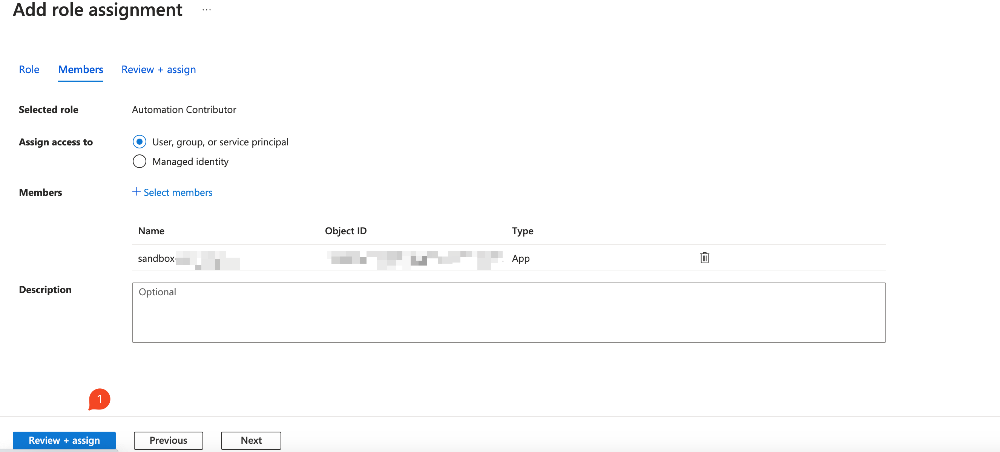

#  Azure Sandbox with GitHub Actions

## Table of Contents

- [Introduction](#introduction)
- [Purpose](#purpose)
- [Prerequisites](#prerequisites)
- [Getting Started](#getting-started)
  - [Create Resource Groups and Runner VM](#create-resource-group-and-runner-vm)
  - [Create an Azure Active Directory application and service principal](#create-an-azure-active-directory-application-and-service-principal)
  - [Create a custom role and assign to app registration](#create-a-custom-role-with-below-permissions-and-assign-to-app-registration) 
  - [Create Azure Automation Account in Azure](#create-azure-automation-account-in-azure)
  - [Google Workspace Service Account Setup Guide](#google-workspace-service-account-setup-guide-which-is-stored-as-secret-in-credentials_file)
- [Workflow](#workflow)
- [Clean up Infra](#clean-up-infra)
- [Authors](#contributing)
- [License](#license)


## Introduction
This repository contains code and configurations to set up an Azure Sandbox environment using GitHub Actions. The Azure Sandbox allows users to experiment with Azure resources in a safe and isolated environment. By leveraging GitHub Actions, we automate the deployment and teardown of the sandbox, making it easy to spin up and tear down the environment as needed.

When users request access to the Azure Sandbox through GitHub Actions, a new Resource Group is created, granting them Contributor permissions for their specified time duration. This time-based access allows users to work with the resources they need without worrying about manual setup or cleanup.

Once the specified time elapses, GitHub Actions automatically revokes the user's access to the Resource Group and deletes it, ensuring that resources are not left unused, minimizing costs, and maintaining a clean environment.

## Purpose
Our objective is to tackle resource management challenges in Azure by automating an Azure Sandbox environment using GitHub Actions. This solution aims to prevent untracked running resources that lead to unexpected costs, ensuring efficient resource utilization and controlled provisioning. Through this approach, we aim to optimize costs, enhance resource tracking, and establish a consistent and proactive management system, enabling a collaborative and streamlined process within Azure environments.

### Use Case
##### Proof of Concept (PoC) Environments
During the initial stages of a project, teams often set up PoC environments to test various solutions and configurations. Using the automated Azure Sandbox approach, you can easily provision resources required for the PoC, ensure they are active only when needed, and automatically deprovision them once the testing phase is over. This prevents unnecessary resource costs and ensures a clean slate for each new PoC iteration.

##### Interview Process
When conducting technical interviews or coding challenges, you may need to provide candidates with isolated environments to complete tasks. With the automated Azure Sandbox, you can create temporary environments for candidates, allowing them to perform tasks within a controlled environment. After the interview process, the resources are automatically removed, avoiding any additional costs.

##### Temporary Workshops or Training Sessions
For workshops, training sessions, or hackathons, where participants require access to specific resources for a limited time, the automated Azure Sandbox can be used to provision resources in advance. Once the event concludes, the resources are automatically deprovisioned, preventing unnecessary costs.

##### Development and Testing Environments
For development and testing purposes, developers often require dedicated environments to build, test, and troubleshoot their applications. By automating the provisioning and deprovisioning of these environments, you can ensure that resources are allocated on-demand and released when no longer needed, optimizing resource utilization and controlling costs.

## Repo Structure
   
```bash
   automated-azure-sandbox-setup/
├── .github
│   ├── ISSUE_TEMPLATE.md
│   ├── PULL_REQUEST_TEMPLATE.md
│   ├── config
│   │   ├── azure_nuke_slack.yaml
│   │   └── azure_provisioning_slack.yaml
│   └── workflows
│       ├── README.md
│       ├── azure-nuke.yml
│       └── azure-provision.yml
├── .gitignore
├── .pre-commit-config.yaml
├── CHANGELOG.md
├── CODEOWNERS
├── CODE_OF_CONDUCT.md
├── CONTRIBUTING.md
├── CONTRIBUTORS.md
├── LICENSE
├── README.md
├── SUPPORT.md
├── azure
│   ├── README.md
│   ├── github_trigger.ps1
│   ├── google-workspace-user.sh
│   ├── google-workspace-validate-users.py
│   ├── gsuite-tokens.zip
│   ├── install_prerequisites.sh
│   ├── requirements.txt
│   └── scheduler.ps1
├── files
│   ├── credential_sample.json
│   └── custom_role.json
└── img
    ├── api_permission.png
    ├── automation_iam.png
    ├── automation_iam_1.png
    ├── automation_iam_2.png
    ├── automation_iam_3.png
    ├── azure_app_registration.png
    ├── cldcvr_logo.png
    └── grant_consent.png
```

## Prerequisites

- **Azure Subscription**: You must have an active Azure subscription with sufficient permissions to create resources and manage RBAC roles.
- **Azure CLI**: Install the Azure CLI on your local machine or the environment where the commands will run.
- **Azure Permissions**:
  - `Application.ReadWrite.All`
  - `Contributor`
  - `Owner or User Access Administrator`

## Getting Started

#### Create Resource Group and Runner VM

- Before executing any Azure commands, ensure you are logged in to your Azure account using the following command:
 
  ```bash
  export AZ_TENANT_ID=xxxxxxxxxx
  az login --tenant "$AZ_TENANT_ID"
  ```
  
- Create Resource Group for Github Runner and Automation Account using below command
  ```bash
  export GITHUB_RUNNER_RG_NAME="GithubRunnerResourceGroup"
  export LOCATION="southeastasia" 
  export SUBSCRIPTION_ID="xxxxxxxxxx"
  export AUTOMATION_ACC_RG_NAME="AutomationAcccountResourceGroup" 


  az group create --name "$GITHUB_RUNNER_RG_NAME" --location "$LOCATION" --subscription "$SUBSCRIPTION_ID"

  az group create --name "$AUTOMATION_ACC_RG_NAME" --location "$LOCATION" --subscription "$SUBSCRIPTION_ID"
  ```
  
- Create a GitHub self-hosted runner VM in the `GITHUB_RUNNER` resource group, you need to start by provisioning a virtual machine (VM) within that resource group. 
    ``` bash 
    export VM_NAME="VIRTUAL_MACHINE_NAME"
    export VM_IMAGE="Ubuntu2204"
    export ADMIN_USERNAME="azureuser"
    
    az vm create \
    --resource-group "$GITHUB_RUNNER_RG_NAME" \
    --name "$VM_NAME" \
    --image "$VM_IMAGE" \
    --admin-username "$ADMIN_USERNAME" \
    --generate-ssh-keys
    
    az vm identity assign -g "$GITHUB_RUNNER_RG_NAME" -n "$VM_NAME"
    
    export VM_NIC="$(az vm show --resource-group "$GITHUB_RUNNER_RG_NAME" --name "$VM_NAME" --query 'networkProfile.networkInterfaces[0].id' --output tsv)"
    
    export VM_NSG="$(az network nic show --ids "$VM_NIC" --query 'networkSecurityGroup.id' -o tsv | cut -d '/' -f9)"
    
    az network nsg rule update --resource-group "$GITHUB_RUNNER_RG_NAME" --nsg-name "$VM_NSG" --name default-allow-ssh --source-address-prefixes <YOUR_IP_ADDRESS>/32
    
    ssh azureuser@<GITHUB_RUNNER_IP>
    ```
- Add GitHub runner in your repository by executing commands on your VM by following document [here](https://docs.github.com/en/actions/hosting-your-own-runners/managing-self-hosted-runners/adding-self-hosted-runners#adding-a-self-hosted-runner-to-a-repository).
- Once it is done then install runner as system service by following document [here](https://docs.github.com/en/actions/hosting-your-own-runners/managing-self-hosted-runners/configuring-the-self-hosted-runner-application-as-a-service).

#### Create an Azure Active Directory application and service principal.

- Create an Azure Active Directory application and configure it by establishing a service principal, assigning necessary roles for desired access, and setting up federated credentials to ensure secure interactions with Azure resources. Additionally, reset the application credentials to generate new passwords.
    ``` bash
    export APP_NAME="sandbox_app_name"
    
    export APP_ID="$(az ad app create --display-name $APP_NAME --query appId -o tsv)"
    
    export ASSIGNEE_OBJECT_ID="$(az ad sp create --id $APP_ID --query id -o tsv)"

    az role assignment create \
      --role contributor \
      --subscription "$SUBSCRIPTION_ID" \
      --assignee-object-id "$ASSIGNEE_OBJECT_ID" \
      --assignee-principal-type ServicePrincipal \
      --scope /subscriptions/"$SUBSCRIPTION_ID"
    
    export APPLICATION_OBJECT_ID="$(az ad app show --id "$APP_ID" --query id -o tsv) "
    
    sed \
      -e 's/org_name/xxxxxxxx/g' \
      -e 's/repo_name/xxxxxxxx/g' \
      -e 's/branch_name/xxxxxxxx/g' files/credential_sample.json > files/credential.json
    
    az ad app federated-credential create --id "$APPLICATION_OBJECT_ID" --parameters files/credential.json
    ```
  
  **Note**: Make a note of secret from below command as it isn't visible on the portal.

  ```bash
  export AZ_MGGRAPH_SECRET_TOKEN="$(az ad app credential reset --id "$APPLICATION_OBJECT_ID"  --append --display-name "$APP_NAME" --years 1 --query password --output tsv)"
  ```

 - Select the App Registration created earlier i.e `$APP_NAME` from azure console
   
      
   
   -  Select API permissions -> Add a permission -> Microsoft Graph -> Application permissions.
   -  All permissions exposed by Microsoft Graph are shown under Select permissions.
   -  Select the permission or permissions you want to grant your application i.e `User.ReadWrite.All`
   -  Select Add permissions.
     
   
   
   -  Carefully review the permissions that the application requires. If you agree, select Grant admin consent.
     
   

- Now by running below commands note the secrets which are required in Github Actions :
  ```bash   
  echo "AZ_CLIENT_ID=$APP_ID"
  echo "AZ_SUBSCRIPTION_ID=$SUBSCRIPTION_ID"
  echo "AZ_TENANT_ID=$AZ_TENANT_ID"
  echo "AZ_MGGRAPH_SECRET_TOKEN=$AZ_MGGRAPH_SECRET_TOKEN"
  ```
  
- Configure above secret in the GitHub secret for authentication by following document [here](https://docs.github.com/en/actions/security-guides/encrypted-secrets?tool=webui#creating-encrypted-secrets-for-a-repository).

#### Create a custom role for Automation Account with below permissions and assign to app registration
   -  Create role using file named custom_role.json and update subscription id as per your environment. *Note: The `sed` command below is run on macOS machine. Linux command may vary.*

      ```bash
      sed -i ' ' \
        -e 's/subscription_id_1/xxxxxxxx/g' \
        -e 's/subscription_id_2/xxxxxxxx/g' \
        -e 's/subscription_id_3/xxxxxxxx/g' \
        -e 's/subscription_id_4/xxxxxxxx/g'  files/custom_role.json

      az role definition create --role-definition files/custom_role.json

      az role assignment create \
        --role runner_custom_role \
        --subscription "$SUBSCRIPTION_ID" \
        --assignee-object-id "$ASSIGNEE_OBJECT_ID" \
        --assignee-principal-type ServicePrincipal \
        --scope /subscriptions/"$SUBSCRIPTION_ID"
      ```

- Go to Azure Active Directory and Click on Roles and administrators and then select Application Developer role and assign to app registration `APP_NAME` created earlier

***NOTE**:  To create resources in another subscription, you should first assign both the Contributor role and a Custom role to the App Registration Service Principal in that particular subscription. This will grant the necessary permissions for the App Registration to perform actions in the target subscription.*

#### Create Azure Automation Account in Azure 

- **Sign in to the Azure portal**: Go to https://portal.azure.com and sign in with your Azure account.
- **Navigate to Automation Accounts**: Once you're in the Azure portal, click on the "Create a resource" button (the "+ New" button) located on the left-hand side. In the search bar, type "Automation" and select "Automation accounts" from the suggested options.
- **Create a new Automation account**: Click the "Create" button to start the creation process.
- **Fill in the required details**:
  - **Subscription**: Choose the Azure subscription you want to create the Automation account in.
  - **Resource group**: select an existing resource group created in beginning to contain the Automation account and its related resources.
  - **Name**: Enter a unique name for your Automation account.
  - **Region**: Choose the Azure region where you want your Automation account to be hosted.
  - **Managed Identities**: Select System assigned identity
  - **Network connectivity**: Select Private Access and create Private Link and select existing vnet in which your runner is running and select webhook.
  - **Click "Review + create"**: After filling in the required details, click the "Review + create" button at the bottom of the page to validate your settings.
  - **Review and create**: Review the details you provided, and if everything looks good, click "Create" to create the Azure Automation account.

##### Configure Azure RBAC for your Automation account
  
  - **Find your Automation Account**: Open your Automation account from the Automation Accounts page.
  - **Navigate to "Access control (IAM)"**: Once you are on the Automation account page, scroll down the left-hand menu and click on `Access control (IAM)`.
  
  - **Add a role assignment**: Click on the `+ Add` button at the top of the `Access control (IAM)` page to add a new role assignment.

    
  
    
  
  - **Assign access**: In the "Add" pane that opens, you need to provide the following information:
    - **Role**: Select `Automation Contributor` from the list. This role provides the permissions to manage runbooks and jobs but not to modify the Automation account itself. 
    - **Assign access to**: Choose the User, group, or service principal option and add Automation Account Name by clicking on select memeber
  
    

    - **Scope**: The scope should be pre-filled with the name of your Automation account. Ensure it is correct.

- Review and Assign: Double-check the details you provided in the "Add " pane and click the "Save" button to create the role assignment.

    

The Azure Automation account will be deployed, and you can access it from the Azure portal. Once the Automation account is created, you can start using it to create and manage Azure Automation runbooks, schedules, and assets to automate tasks within your Azure environment.

# Google Workspace Service Account Setup Guide which is stored as secret in CREDENTIALS_FILE

#### Purpose

The purpose of this setup is to utilize a Google Service Account to validate users within a specific domain. By following these steps, you can ensure secure user authentication and access control for your application or system.

#### Create a Service Account

1. Go to the [Google Cloud Console](https://console.cloud.google.com/) and log in with your Google Workspace administrator account.
2. Click on the project dropdown and select a project or create a new one.
3. Navigate to "IAM & Admin" -> "Service Accounts" in the left-hand sidebar.
4. Click on the "Create Service Account" button.
5. Enter a name and optional description for the service account.
6. Choose the appropriate role(s) for the service account. For example, you might want to grant it the "Service Account Token Creator" role to generate OAuth2 tokens.
7. Click on the "Continue" button.
8. Optionally, add users who should have access to this service account. Typically, it's best to keep the list minimal.
9. Click on the "Done" button to create the service account.

#### Generate a Key for the Service Account

1. In the list of service accounts, locate the service account you just created and click on the three dots (⋮) next to it.
2. Select "Manage keys" from the dropdown.
3. Click on the "Add Key" button.
4. Choose the key type as "JSON" and click on the "Create" button.
5. The key file will be downloaded to your local machine. Keep it secure, as it grants access to your Google Workspace resources.

#### Assign scopes to the Service Account

1. Determine the necessary scopes (permissions) required for your service account to access Google Workspace APIs. Refer to the API documentation to identify the scopes needed for your specific use case.
2. Once you have identified the scopes, go to the [Google Admin console](https://admin.google.com/) and log in with your Google Workspace superadmin account.
3. Navigate to "Security" -> "Access and data control" -> "API Controls" -> "Manage Domain wide delegation" -> "Add new"
4. In the "Client ID" field, paste the Client ID (e.g., `118428936071234567890`) from the service account key file.
5. In the "OAuth Scopes" field, add the required scopes, separated by commas (`,`). In this case scope is user and group read only.
6. Click on the "Authorize" button to grant the specified scopes to the service account.

# Workflow

In the repository, the workflow file can be found in the .github/workflows/ directory.

- GitHub Actions Workflow for Azure Sandbox Creation and Cleanup, click [here](https://github.com/cldcvr/sandbox-provisioner-azure/blob/main/.github/workflows/README.md).
- Replace below variables in workflow yaml as per your environment manually or using below commands
  - azure-provision.yml
    - `runner_name`
    - `github_user`
    - `automation_account_rg`
    - `automation_account_name`
    - `subscription_name_1`
    - `subscription_name_2`
    - `subscription_name_3`
    - `subscription_name_4`
    - `subscription_name_5`
  ```bash
  sed -i '' \
    -e 's/runner_name/your_runner_name/g' \
    -e 's/github_user/your_github_user/g' \
    -e 's/automation_account_rg/your_automation_acc_rg/g' \
    -e 's/automation_account_name/your_automation_acc_name/g' 
    -e 's/subscription_name_1/xxxxxxxxx/g' \
    -e 's/subscription_name_2/xxxxxxxxx/g' \
    -e 's/subscription_name_3/xxxxxxxxx/g' \
    -e 's/subscription_name_4/xxxxxxxxx/g' \
    -e 's/subscription_name_5/xxxxxxxxx/g' azure-provision.yml

  ```
  - azure-nuke.yml
    - `runner_name`
    - `automation_account_rg`
    - `automation_account_name`
  ```bash
  sed -i '' \
    -e 's/runner_name/your_runner_name/g' \
    -e 's/automation_account_rg/your_automation_acc_rg/g' \
    -e 's/automation_account_name/your_automation_acc_name/g' azure-nuke.yml
  ```
- Replace below variables in below scripts as per your environment manually or using below commands
   - azure/google-workspace-validate-users.py
     - `domain_name`

   - azure/google-workspace-user.sh
     - `google_auth_email_id`
   
   ```bash
  sed -i '' \
   -e 's/domain_name/your_domain_name/g' azure/google-workspace-validate-users.py

  sed -i '' \
   -e 's/google_auth_email_id/your_google_auth_email_id/g' azure/google-workspace-user.sh

  ```

- Push the above changes to your repository.
- Create PAT token for your user and add in GitHub secret [here](https://docs.github.com/en/enterprise-server@3.6/authentication/keeping-your-account-and-data-secure/managing-your-personal-access-tokens#creating-a-personal-access-token).

#### Secrets and Environment variables used in GitHub actions

To run this workflow, you will need to add the following secrets and environment variables.

| Secret                    | Description                                                                                  |
|:--------------------------|:---------------------------------------------------------------------------------------------|
| `AZ_CLIENT_ID`            | Azure Application (client) ID                                                                |
| `AZ_TENANT_ID`            | Azure Application Directory (tenant) ID                                                      |
| `AZ_SUBSCRIPTION_ID`      | Subscription ID                                                                              |
| `SLACK_WEBHOOK`           | Slack webhook URL which will notify on workflow failure                                      |
| `CREDENTIALS_FILE`        | This is used to authenticate Google Workspace to validate users' email ID                    |
| `AZ_MGGRAPH_SECRET_TOKEN` | This is used to authenticate Azure using a token to validate users in Azure Active Directory |
| `GIT_TOKEN`               | Personal Access token of GitHub User                                                         |


| Environment variables | Description                                                                                                                                                  |
|:----------------------|:-------------------------------------------------------------------------------------------------------------------------------------------------------------|
| `GITHUB_USER_NAME`    | Username of your GitHub account where your Actions are present. This variable will be used in the script to trigger the GitHub Action to nuke the resources. |
| `GITHUBREPO`          | Repository name of your GitHub where your GitHub Action and script are present.                                                                              |
| `RAGNAME`             | Resource Group name where you want to create the Runbook in Automation                                                                                       |
| `AUTOMATION_NAME`     | Automation Account name where all run-books will be created.                                                                                                 |
| `AUTOMATION_RG`       | Automation Account Resource Group                                                                                                                            |
| `AUTOMATION1`         | Script name of the runbook which we are creating to trigger the action that nukes the user's access.                                                         |
| `AUTOMATION2`         | Script name of the runbook created to schedule Automation1 Runbook.                                                                                          |
| `LOCATION`            | Location where sandbox resources are created                                                                                                                 |
| `SLACK_WEBHOOK_URL`   | Slack alert will be send on failure                                                                                                                          |

# Clean up Infra 

- Login into Azure 
- Remove role assignment contributor and custom role for azure sandbox app
- Remove Automation Contributor role assigned at Automation Account IAM level.
- Delete Resource group for GitHub runner and Automation account
  
# License
This documentation is licensed under the Apache License. See the [LICENSE](LICENSE) file for details.

Contributions and feedback are welcome! Let's make Azure Sandbox easier for everyone. 🌟

#azuresandbox #googleworkspace #serviceaccount  #opensource
